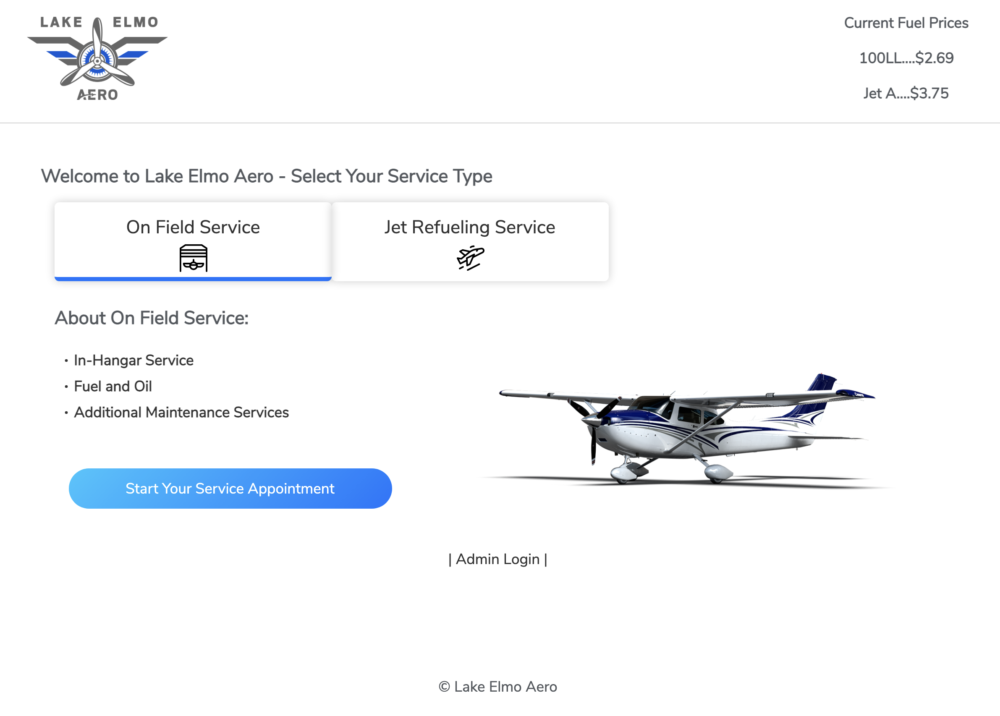
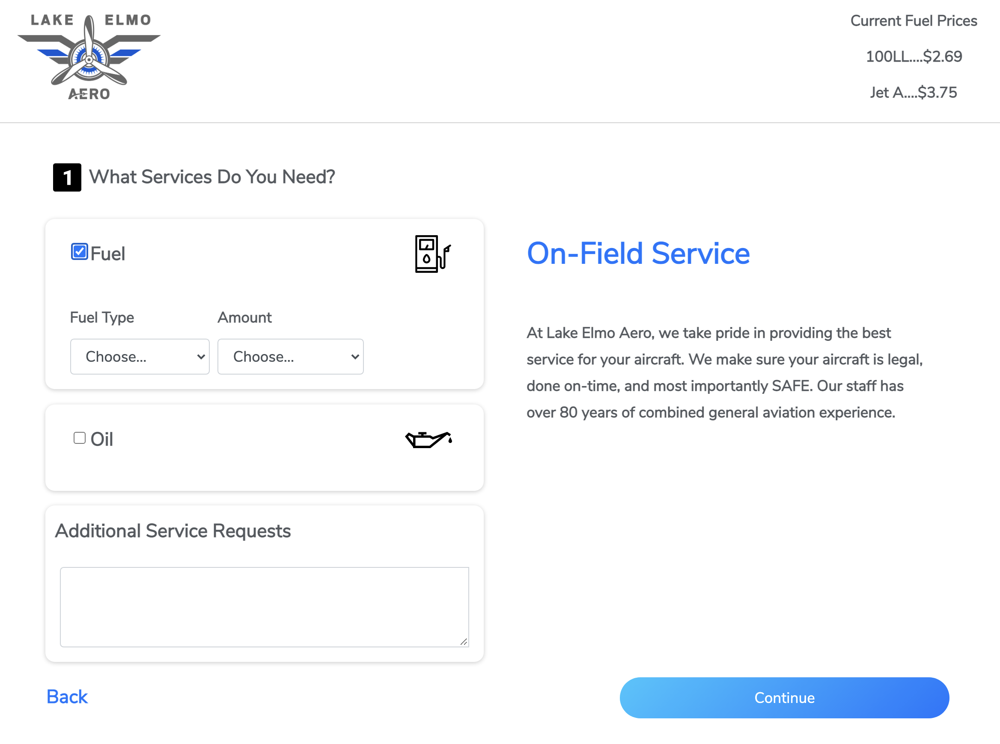
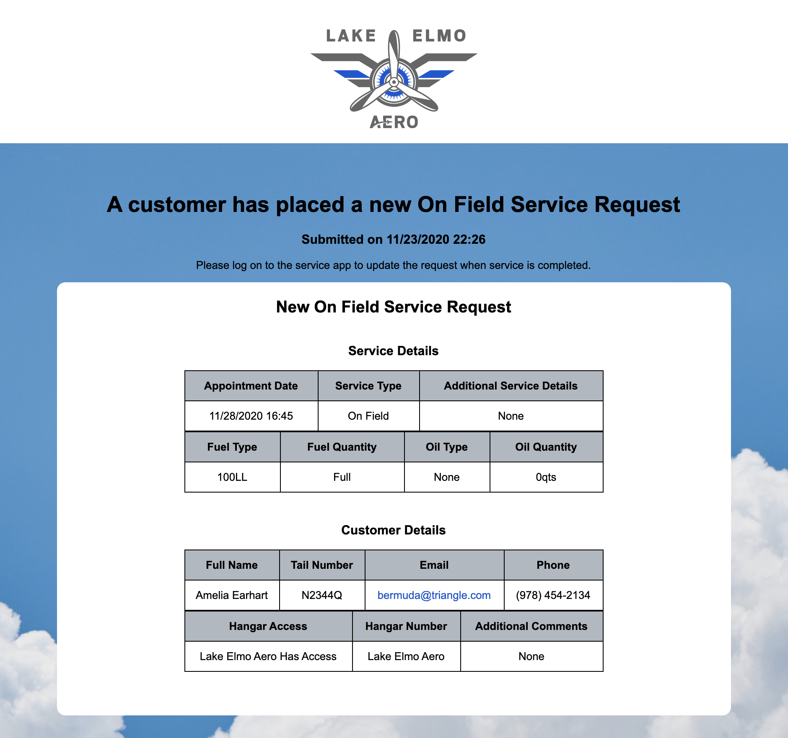

# Lake Elmo Aero - Client Project

## Description

_Duration: 2 Week Sprint_

This app is a capstone project and collaboration between [Tyler Jorenby](https://github.com/TJorenby), [Justus Witmer](https://github.com/justuswitmer), [Leah Brenny](https://github.com/leahbrenny), and [Derek Williamson](https://github.com/derekwilliamson22).

Our client, [Lake Elmo Aero](https://www.lakeelmoaero.com/), requested an app that would improve their customer's service experience as well as improve their efficiency and logistics behind the scenes. 

The app is based on the now familiar service request form which prompts users to make choices based on the their needs, in this case, fuel and general maintenance of their personal aircraft, followed by their contact information.

We have incorporated both Sendgrid and Twilio technologies to create a more robust customer communication experience as well as providing notifications to the service techs of new service requests.

<!-- To see the fully functional site, please visit: [DEPLOYED VERSION OF APP](www.heroku.com) -->

## Screen Shot

Below are select images from the service request process.

## The User's Landing Page 

## The First Step in the On Field Service Request Form

## An example of an email the Admin/Service Tech would receive after a new service request is made

### Prerequisites
These are just some of the main technologies we utilized. 
Be sure to `npm install` after fork and cloning to receive all of the dependencies listed in the `package.json`.

- [Node.js](https://nodejs.org/en/)
- [React] (https://reactjs.org)
- React-Redux
- Redux-Saga
- PostGreSQL

## Installation

1. Create a database named `lake_elmo_aero`,
2. The queries in the `database.sql` file are set up to create all the necessary tables and populate the needed data  
   to allow the application to run correctly. The project is built on [Postgres](https://www.postgresql.org/download/), so you will need to make sure to have that installed. We recommend using Postico to run those queries as that was used to create the queries. 
3. Open up your editor of choice and run an `npm install`
4. Run `npm run server` in your terminal
5. Run `npm run client` in your terminal
6. The `npm run client` command will open up a new browser tab for you!

## Usage

1. A new user would navigate to the landing page from the Lake Elmo Aero home page.
2. Based on their needs, they would either choose the On Field or Jet Refueling service form.
3. Both paths lead to the user through a series of input fields to collect information about their appointment 
4. Upon completion, the user is sent an email confirmation and the admin/service tech is sent an SMS text message and 
   email notifying them of a new service request.
5. Once the service is complete, the tech marks the service as complete, which sends an email message to the user that their service request has been completed.

## Built With

- material-ui
- sendgrid/mail
- axios
- bootstrap
- date-fns
- express
- moment
- twilio

Please see the `package.json` for a full list of dependencies and technologies. 

## Acknowledgement
Thanks to [Prime Digital Academy](www.primeacademy.io) who equipped and helped us to make this application a reality. A special shout out to our Instructor, [Edan Schwartz](https://github.com/eschwartz)

## Support
If you have suggestions or issues, please email [tyler.jorenby@gmail.com](www.google.com)
